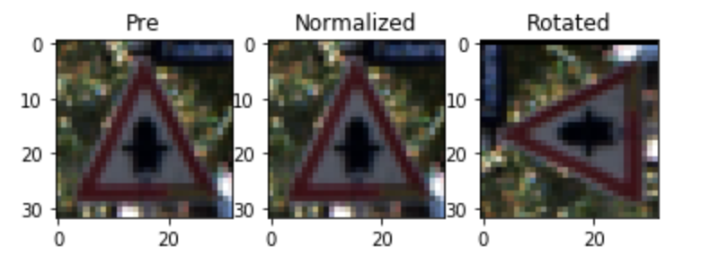
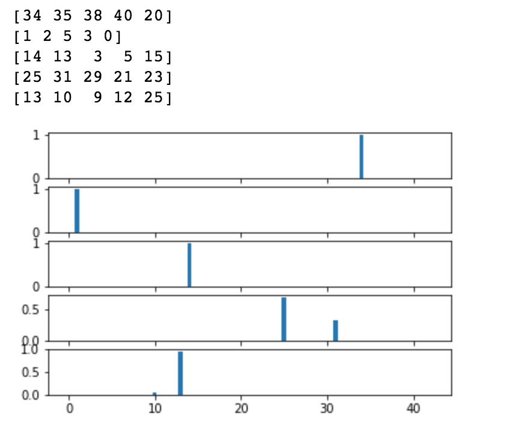

# **Traffic Sign Recognition** 

## Writeup
---

**Build a Traffic Sign Recognition Project**

The goals / steps of this project are the following:
* Load the data set (see below for links to the project data set)
* Explore, summarize and visualize the data set
* Design, train and test a model architecture
* Use the model to make predictions on new images
* Analyze the softmax probabilities of the new images
* Summarize the results with a written report

**Data Set Summary**
	The provided data included a training set, validation set, and test set.  All we had to do was download the files and point to them and pickle did the rest!  We didn't even have to split the training set into two since the validation set was provided which was nice.
When looking at the distributions of the training and validation sets, they had near identical distributions of traffic signs with the more common signs(speed, stop, yield, no passing, etc) being far more numerous than the other signs by a factor of up to 7* more prevalent.  This might affect the ability of the network to train on these under-represented signs.  I also noticed that some of the images are extremely dark and difficult to see even after normalization.  I didnt try it but I would be curious to see if you were to filter out the dark images if it would negatively or positivily affect the networks ability to train.  Perhaps these images make the network more resilient to image distortion or perhaps they make the network train to give false positives and mismatch probabilites for similar signs.  

* The size of training set is 34799
* The size of the validation set is 34799
* The size of test set is 12630
* The shape of a traffic sign image is (32,32, 3)
* The number of unique classes/labels in the data set is 4

#### 2. Exploratory visualization of the dataset.

Bar charts showing how the data is distributed throughout the classes in the training, validation and testing data sets

### Design and Test a Model Architecture

#### 1. Normalizing

	I normalized the images to minimize large calculation errors and allow for faster calculations and faster training rate by conditioning the training data.
I also wanted to double the size of the training and validation set by taking the normalized data and adding a rotated copy of each image.  My thought was that adding rotated images will make the network more robust by taking advantage of the spatial awareness of a CNN.  However I was training on my local machine and I must have run out of memory(Kernel crashed) so I never got to fully test this.

Pictures of the processed images

#### 2. Final Model

My final model consisted of the following layers:

| Layer         		|     Description	        					| 
|:---------------------:|:---------------------------------------------:| 
| Input         		| 32x32x3 RGB image   							| 
| Convolution 3x3     	| 1x1 stride, same padding, outputs 28x28x6 	|
| RELU					|												|
| Max pooling	      	| 2x2 stride,  outputs 14x14x6 					|
| Convolution 3x3	    | 14X14X6 input									|
| RELU					|	        									|
| Max pooling			| 2x2 stride, outputs 5x5x16					|
| Flatten				| Outputs 1x 400								|
| Fully Connected		| 400, output 120								|
| RELU  				| 												|
| Dropout 				| Keep Prob 75%									|
| Fully Connected 		| 120, output 84								|
| RELU 					|												|
| Fully Connected 		| 84, output 43									|

This is pretty much the same LeNet from the lab but modified for the 43 output classes.  The only thing I added was a DropOut layer to help stop overfitting and better incremental consistency.

#### 3. Training the Model 

I kept the Adam Optimizer from the lab since it is "More sophisticated than stochastic gradient descent".  Upped the Epochs to 20, more training generally means it trains more completely.  Reduced the batch size to 64, essentially doubled the epochs and halved the batch size.  Lower standard deviation in the weights init seemed to produce higher accuracy with normalized images, I went with 0.75.  I also put the dropout rate at 75% kept.  I kept the learning rate the same.

#### 4. Training Approach 

I took an iterative approach to tuning the parameters initially, trying to maximize validation accuracy.  Then I looked through the suggested pre-processing and reviewed the lessons again for different strategies.  I noticed that most parameter combinations ended up with over-fitting, so thats why I implemented a drop out layer.  Once I had the the pre-processing and model updated, I started tweeking the tuning parameters again for maximum accuracy

My final model results were:
* training set accuracy of 98.7%
* validation set accuracy of 98.8%
* test set accuracy of 88.3%

I chose the LeNet architecture since it was the one studied so I understood it best. With simple tweaking of tuning parameters it could achieve >90% accuracy.  
 

### Test a Model on New Images

#### 1. Choose five German traffic signs found on the web and provide them in the report. For each image, discuss what quality or qualities might be difficult to classify.

Here are five German traffic signs that I found on the web:

   
 

[Left Turn](https://cdn.xl.thumbs.canstockphoto.com/road-sign-turn-left-against-the-blue-sky-stock-photography_csp36280602.jpg)
[Speed 30](http://c8.alamy.com/comp/G667W0/road-sign-speed-limit-30-kmh-zone-passau-bavaria-germany-G667W0.jpg)
[Stop](https://upload.wikimedia.org/wikipedia/commons/thumb/f/f9/STOP_sign.jpg/220px-STOP_sign.jpg)
[Work](http://a.rgbimg.com/cache1nHmS6/users/s/su/sundstrom/300/mifuUb0.jpg)
[Yield](https://previews.123rf.com/images/pejo/pejo0907/pejo090700003/5155701-German-traffic-sign-No-205-give-way-Stock-Photo.jpg)

I chose these images specifically since they looked similar to the images in the training set.  They were images that were centered and took up most of the frame and didnt contain any other objects and were brightly lit.  

The stop sign we not straight on so the classifier might have difficulty recognizing the shape.  The left turn sign was pretty much the same color as its image background, this also might be difficult for the classifier to recognize.
The other three seem to be ideal images for the classifier, there is a watermark over the Yield but that might not matter as the classifier should ignore it

#### 2. Predictions

Here are the results of the prediction:

| Image			        |     Prediction	        					| 
|:---------------------:|:---------------------------------------------:| 
| Left Turn      		| Left Turn   									| 
| Speed 30     			| Speed 30 										|
| Stop					| Stop											|
| Work		      		| Work							 				|
| Yield          		| Yield 	     								|

The model was 5/5!  This is even better than the test set accuracy of <90%.  Perhaps the images hit the sweet spot and had all the characteristics the network trained on.  Id be interested in testing a larger data set.

#### 3. Model Prediction Softmax 

I wrote the code to view the top 5 softmax probabilities and to match them with the sign types.  They were printed out in the following:

 

Some visualization Bar Graphs

### (Optional) Visualizing the Neural Network (See Step 4 of the Ipython notebook for more details)
#### 1. Discuss the visual output of your trained network's feature maps. What characteristics did the neural network use to make classifications?

Didnt get to this part

